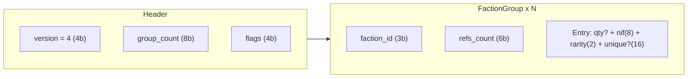

# V4 Binary Format Recommendation

## Design goals (your criteria)

| Encode | Ignore on encode | Decode behavior |
|--------|------------------|-----------------|
| FamilyID = `(faction, number_in_faction)` | Set, Product (A/P/B), Alt-art, Promo | Reconstruct set via **hard-coded `(faction, nif) → set` table**; always emit `_B_` booster |
| Rarity: C, R1, R2, U (2 bits) | Exalt (no separate code) | `E` and `C` both encode as `0`; decode emits `C` |
| Unique: **16-bit word** when `U` (see below) | Set for non-CORE/COREKS uniques | Set from family table; CORE/COREKS split via bit 0 when family exists in both |

V4 is **not backward-compatible** with V3. Keep the existing [`src/bitstream/`](src/bitstream/) infrastructure and add [`src/syntax_v4.ts`](src/syntax_v4.ts) alongside V3.

---

## Why not reuse V3 SetGroups?

V3’s largest overhead in your real examples is **per-set grouping** ([`FORMAT_SPEC_V3.md`](FORMAT_SPEC_V3.md)): each `SetGroup` pays ~30–50 bits for set name + count + optional `family_id_bit_length`, plus per-card product (1 bit) and set-implied context.

Analysis of [`test/decklists/real_examples/`](test/decklists/real_examples/):

| Deck | Distinct V4 entries | Uniques | Max nif | Qty > 3 |
|------|---------------------|---------|---------|---------|
| standard_1 | 18 | 3 | 82 | 0 |
| standard_2/3 | 22 | 3 | 102 | 0 |
| singleton_1 | 61 | 0 | 101 | 0 (all qty 1) |
| singleton_2 | 60 | 4 | 82 | 0 |
| sandbox_2 | 73 | 0 | 101 | 0 |
| sandbox_1 | 85 | 0 | 147 | 6 lines |

**Normalization merges are ~0** in these files (alt-art/promo lines use different family numbers; exalt lines don’t duplicate commons). The win is structural, not deduplication.

Estimated Base64 length vs approximate V3 (**Option B** — faction groups, fixed nif):

- **standard_1**: ~55 vs ~63 chars (**−13%**)
- **singleton_1**: ~125 vs ~179 chars (**−30%**)
- **sandbox_2**: ~170 vs ~212 chars (**−20%**)

---

## Recommended format: **Faction-Grouped Entry List (Option B)**

Group entries by faction, omitting the per-entry faction field. Each entry carries a fixed **8-bit** `number_in_faction` — no delta/offset compression within groups (simpler than V3 SetGroups).



### Header (16 bits)

```
int(4)  version          MUST be 4
int(8)  group_count      Number of FactionGroup elements (1..256)
int(1)  all_qty_one      If 1, every entry has quantity 1 (omit per-entry qty)
int(1)  reserved         MUST be 0
int(2)  reserved         MUST be 0
```

`all_qty_one` saves **~2 bits × 60 entries ≈ 15 Base64 chars** on singleton decks.

### FactionGroup

```
int(3)  faction_id       1=AX, 2=BR, 3=LY, 4=MU, 5=OR, 6=YZ, 7=NE (same as V3)
int(6)  refs_count       Entries in this group (1..63; split into multiple groups if exceeded)

[refs_count × Entry]
```

**Sizing:** largest per-faction entry count in [`test/decklists/real_examples/`](test/decklists/real_examples/) is **46** (`YZ` in sandbox_1). **6 bits** (max 63) is sufficient — same as V3 `SetGroup.refs_count`. 8 bits would add ~2 bits × group_count (~12 bits on sandbox decks) with no benefit on current or near-term deck sizes.

| File | Total entries | Max per faction |
|------|---------------|-----------------|
| sandbox_1 | 85 | 46 (YZ) |
| singleton_2 | 60 | 45 (OR) |
| singleton_1 | 61 | 34 (MU) |
| sandbox_2 | 73 | 16 (AX) |
| standard_* | 18–22 | 13–18 (LY/AX) |

Encoders MUST sort groups by `faction_id` ascending, and entries within each group by `number_in_faction` ascending.

It is valid to have multiple `FactionGroup` elements with the same `faction_id` (when a faction exceeds 63 entries); decoders MUST support this.

### Entry

Each entry in a `FactionGroup` is encoded **in this order** (same quantity-first convention as V3 [`CardRefQuantity`](FORMAT_SPEC_V3.md)):

```
1. Quantity     variable length; omitted entirely when header.all_qty_one == 1
2. NIF          int(8) number_in_faction_minus_1
3. Rarity       int(2)
4. Unique word  int(16); present if and only if Rarity == 3 (U)
```

#### 1. Quantity

When `all_qty_one = 0`, reuse the V3 variable-length scheme:

```
int(2) quantity
  1..3 => quantity
  0    => read int(6) extended_quantity; real qty = extended + 3 (max 65)
```

When `all_qty_one = 1`, omit the quantity field entirely (implicit quantity 1).

#### 2. NIF (fixed 8 bits, every entry)

```
int(8)  number_in_faction_minus_1   range 0..255 (nif 1..256)
```

#### 3. Rarity (2 bits, every entry)

```
0 = C   (Common; `E` Exalt also encodes as 0 — same wire value, no separate step)
1 = R1  (Rare in-faction)
2 = R2  (Rare out-of-faction / OOF)
3 = U   (Unique)
```

Dropping Exalt and set-specific 3-bit rarity saves **1 bit/card** on DUSTER-family cards vs V3.

#### 4. Unique extension (16 bits, only when Rarity == 3)

Single 16-bit word — no separate `is_coreks` field. Interpretation depends on whether `(faction, nif)` exists in **both** CORE and COREKS (109 families in catalog; max unique_id **8980**, fits in 15 bits).

**Dual CORE/COREKS family** (family exists in both sets):

```
int(16) unique_word
  bit 0       is_coreks: 0 = CORE, 1 = COREKS
  bits 1..15  unique_id: range 1..32767 (0 in payload reserved/invalid)
```

**All other unique families** (ALIZE, BISE, DUSTER, … — set implied by family ID):

```
int(16) unique_id        range 1..65535 (0 reserved/invalid)
```

Decoders determine which layout applies after reading `faction_id` + `number_in_faction`, via family metadata in [`src/canonical_sets.ts`](src/canonical_sets.ts) (e.g. `dual_core_coreks: boolean`). Non-dual families never use bit 0 for set disambiguation — the canonical `(faction, nif) → set` table supplies the set name on decode.

**Catalog verification** ([`rust-cards-api/build/full_index/ALL_SETS/catalog.json`](c:\Users\taumx\Documents\GitHub\rust-cards-api\build\full_index\ALL_SETS\catalog.json)):

| Metric | Value |
|--------|-------|
| Global `max_unique_id` | **46143** (`YZ_35` / ALIZE) |
| Dual CORE+COREKS families | **109** (every CORE/COREKS family appears in both) |
| Max unique in dual families | **8980** (15-bit payload sufficient) |
| Non-dual families needing full 16-bit id | **309** (max 46143 — full word required) |
| 13-bit id (8191 max) sufficient? | **No** (real examples include 10103) |
| 16-bit full word sufficient? | **Yes** |

### Flat vs faction-grouped: comparison

Analyzed against [`test/decklists/real_examples/`](test/decklists/real_examples/) (family-key bits only; excludes rarity/qty/unique):

| Option | Structure | sandbox_2 (73 entries, 6 factions) | standard_2 (22, 3 factions) | Complexity |
|--------|-----------|--------------------------------------|-----------------------------|------------|
| **A. Flat** | `faction(3) + nif(8)` per entry | 803 bits | 242 bits | Lowest |
| **B. Faction groups, fixed nif** | `header(9b)×F` + `nif(8)` per entry | 638 bits (**−165**) | 203 bits (**−39**) | Moderate |
| **C. Faction groups + delta nif** | B + V3-style `nif_bit_length` offsets | 587 bits (**−216**) | 191 bits (**−51**) | Same as V3 SetGroup |

Estimated **full-deck Base64 savings** vs flat (family + rarity + qty, no uniques): sandbox ~**17–22 chars**, singleton ~**14–18 chars**, standard ~**3–5 chars**.

**Why faction grouping wins:** every real example uses only 3–6 factions but 18–85 entries. Repeating `faction_id` on every entry wastes 3 bits × (entries − factions). Group headers cost 9 bits each (`faction(3) + refs_count(6)`), and break-even is ~4 entries per faction — all real decks exceed this (e.g. standard_2 has 18 LY entries alone).

**Why Option B over C:** Option C (delta nif within faction) saves an additional ~5–51 bits on family keys in real examples — roughly **4–7 Base64 chars** on large decks. Option B avoids `nif_bit_length`, first-card absolute vs offset rules, and min-nif ordering constraints, while still capturing **~80% of the faction-grouping win**.

**Why NOT global delta (flat list):** entries sorted by `(faction, nif)` jump across factions; offsets would often exceed 8 bits, so flat 11-bit keys are better than a single global delta base.

**Recommendation: Option B** (faction groups, fixed 8-bit nif). Option C remains a future optimization if size pressure increases.

### Trailing padding

Byte-align with zero bits (same rule as V3). Output as **base64url** (existing [`src/encoder.ts`](src/encoder.ts) convention).

---

## Encode-time normalization pipeline

Before writing entries, transform input lines:

1. Parse with existing [`CardRefElements`](src/models.ts) regex (extend later for FUGUE/EOLE in sandbox_1).
2. **Strip** product and set; for dual CORE/COREKS families, pack `is_coreks` into bit 0 of `unique_word`.
3. **Merge** lines with identical `(faction, nif, encoded_rarity, unique_word)` by summing quantity — `encoded_rarity` maps both `C` and `E` to `0`.
4. **Group** by `faction_id`; sort groups ascending, entries within group by `nif` ascending.
5. Set `all_qty_one = 1` iff every merged quantity is 1.

No separate text-level fold step: `E` and `C` are treated as the same rarity at encode time via the rarity ID mapping (`E` → 0, same as `C`).

---

## Decode-time canonical reconstruction

V4 wire format is intentionally set-less. Decoders rebuild text IDs using:

```
ALT_{canonical_set}_{B}_{faction}_{nif padded}_{rarity}[_unique_id]
```

- **`canonical_set`**: from `(faction, nif) → set_name` lookup in [`src/canonical_sets.ts`](src/canonical_sets.ts), plus family metadata (`dual_core_coreks`).
- **`_B_`**: always booster (alt-art/promo distinction discarded).
- **Dual CORE/COREKS uniques**: extract `is_coreks` from bit 0 of `unique_word`; set = `COREKS` if 1 else `CORE`. Remaining bits = `unique_id`.
- **Other uniques**: full `unique_word` = `unique_id`; set from family table.
- **Number padding**: reuse V3 logic in [`src/syntax_v3.ts`](src/syntax_v3.ts) `asCardId` (leading zero for nif < 10 except NE in CORE/COREKS).

**Round-trip note:** V4 encode → V4 decode will **not** match original lines when input used alt-art, promo, or non-canonical sets. Tests should compare normalized semantic equality, not string equality with source files.

---

## Per-entry bit budget (reference, Option B)

Faction group header: 9 bits (`faction(3) + refs_count(6)`), amortized over entries in the group.

| Entry type | Bits (qty explicit) | Bits (all_qty_one) |
|------------|---------------------|--------------------|
| Non-unique | 2 qty + 8 nif + 2 rarity = **12** | 8 nif + 2 rarity = **10** |
| Unique | 2 + 8 + 2 + 16 = **28** | 8 + 2 + 16 = **26** |

Compare to flat Option A: 15 bits/non-unique, 32/unique — faction grouping saves **3 bits/entry** (omitted faction field).

---

## Alternatives considered (and why not)

| Alternative | Verdict |
|-------------|---------|
| V3 SetGroups without product | Still pays set-name overhead; poor fit when a deck spans 6+ sets |
| Flat list (Option A) | Simplest decode; ~3 bits/entry larger than Option B |
| Faction groups + delta nif (Option C) | ~4–7 Base64 chars smaller on large decks; deferred — add `nif_bit_length` later if needed |
| 14-bit unique IDs | Rejected: catalog max is 46143; 114 families exceed 16383 |
| Embedded set in non-unique entries | Violates your “don’t care about set” goal and costs ~4–6 bits/card |
| gzip/zstd wrapper | **Not worth it** for URL-shared deck codes — see compression note below |

**Compression note (V3-encoded decks, gzip level 9):**

| Payload | Raw bytes | Base64url | Gzip(raw) | Gzip+base64 |
|---------|-----------|-----------|-----------|-------------|
| standard_2 | 82 | 112 | 105 (+28% vs raw) | ~140 (worse than plain b64) |
| sandbox_2 | 158 | 212 | 181 (+15%) | ~242 (worse than plain b64) |
| singleton_1 | 138 | 184 | 161 (+17%) | ~215 (worse) |
| test_collection | 2490 | 3320 | 2513 (+1%) | ~3351 (break-even) |

- Gzip/zstd **never beat raw binary** on deck-sized payloads (format header overhead ~20–30 bytes dominates).
- Gzip **sometimes beats base64** on raw bytes alone (8/22 test decks), but only when you skip base64 — not viable for URL-safe sharing.
- **Compress-then-base64 is always worse** except near-collection-scale inputs (~2KB+ raw).
- V4 raw payloads will be smaller still → even less compressible.

Optional: add a `test/benchmark/compression.test.ts` when V4 lands to confirm with zstd (`@mongodb-js/zstd`), but expect the same conclusion.

---

## Implementation outline (when you move past planning)

1. Add [`FORMAT_SPEC_V4.md`](FORMAT_SPEC_V4.md) mirroring V3 spec style.
2. Implement [`src/syntax_v4.ts`](src/syntax_v4.ts): `EncodableFactionGroup` / `EncodableDeckV4` — simpler than V3 (no set name, no product, no delta nif).
3. Add [`src/canonical_sets.ts`](src/canonical_sets.ts): `(faction, nif) → set` lookup + `dual_core_coreks` flag per family (generate from catalog).
4. Wire `encodeListV4` / `decodeListV4` in [`src/encoder.ts`](src/encoder.ts) and [`src/index.ts`](src/index.ts).
5. Tests in [`test/codec.test.ts`](test/codec.test.ts) using [`test/decklists/real_examples/`](test/decklists/real_examples/) with **semantic** assertions + fixed Base64 golden strings once canonical table is stable.
6. Benchmark script comparing V3 vs V4 sizes on real examples (extend [`test/benchmark/runlength.test.ts`](test/benchmark/runlength.test.ts)).

---

## Open item: canonical family→set table

The format recommendation is complete, but decode behavior depends on this external table. Before implementation, define:

- Source of truth (community CSV, generated from card DB, hand-maintained per set release)
- Policy for families printed in multiple sets (latest set? preferred print? CORE if exists?)
- Coverage for new sets in sandbox_1 (`FUGUE`, `EOLE`) not in current [`RefSetCode`](src/models.ts)

This table does not affect encoded size—only decode output.
